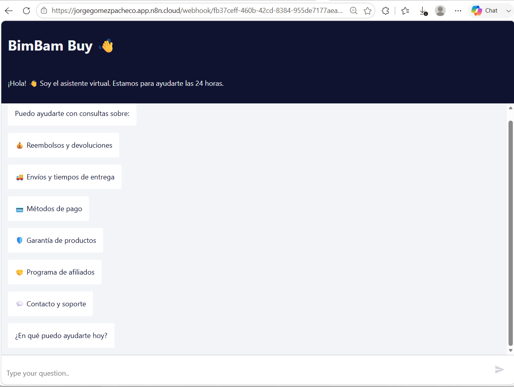
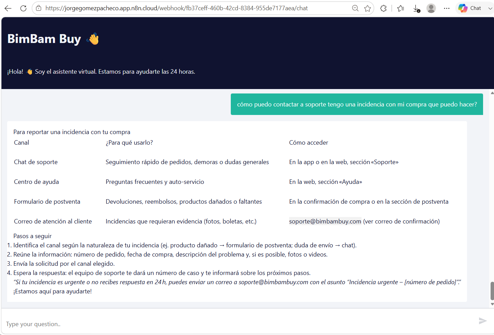
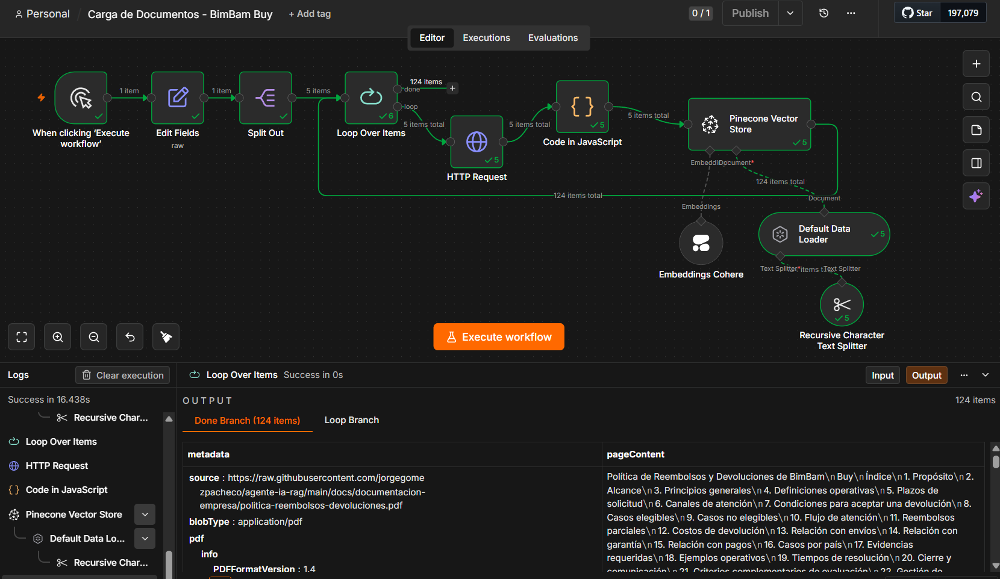
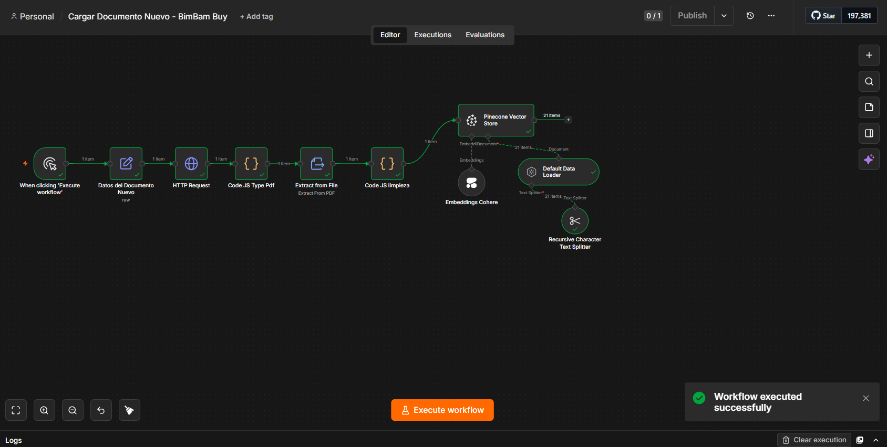
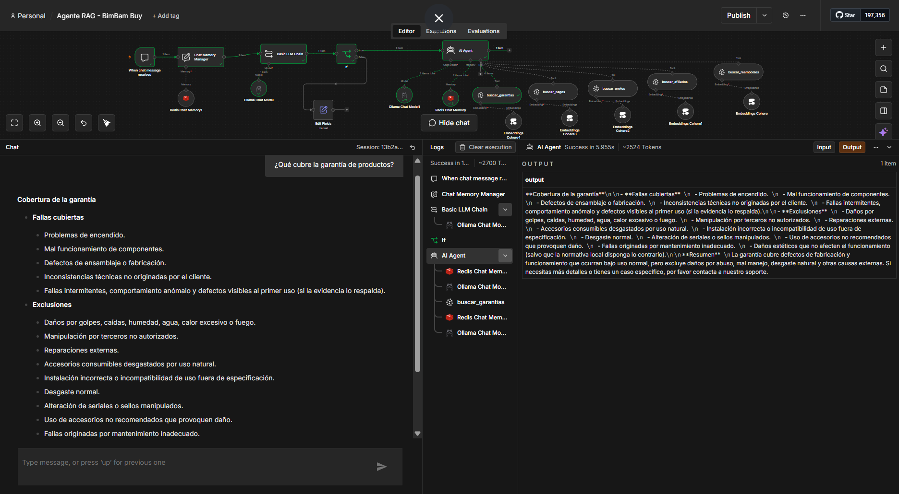
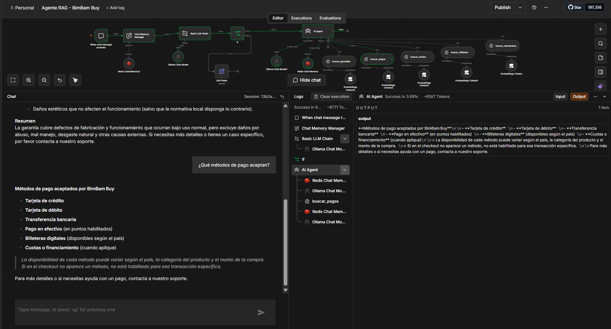
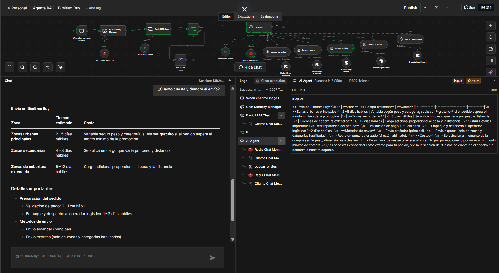
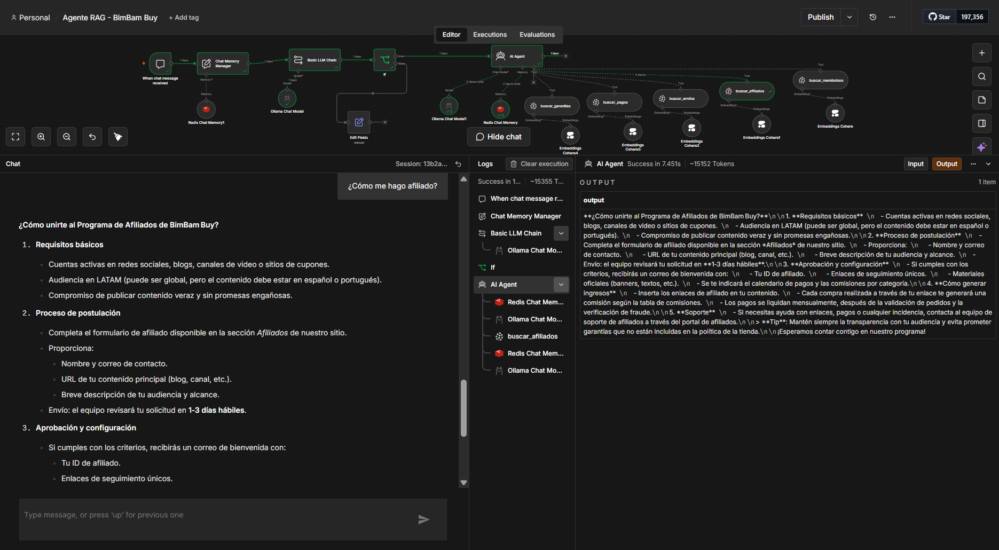
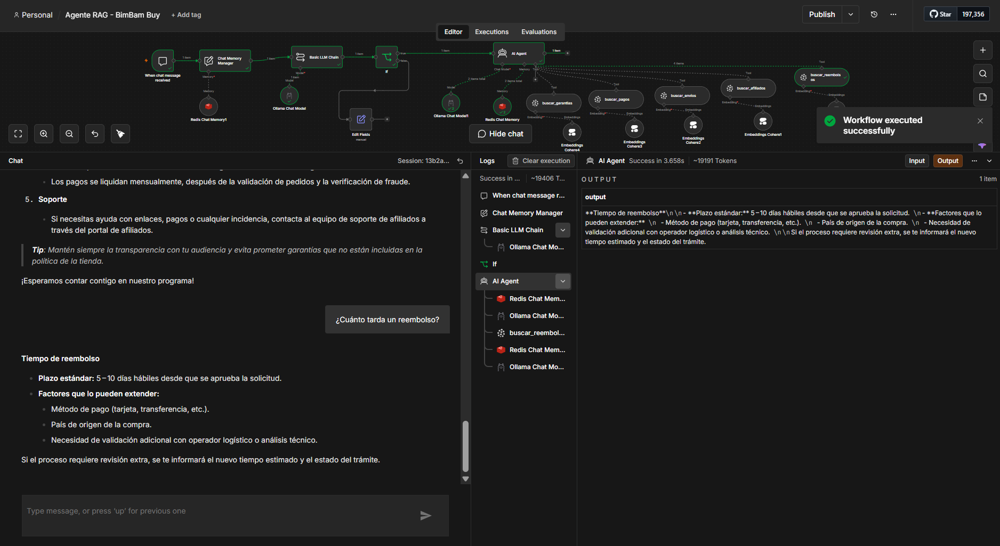
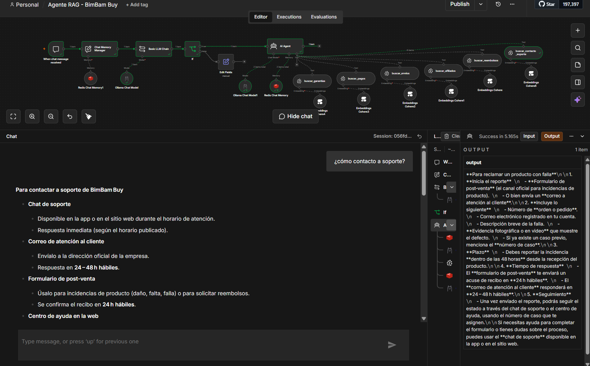

# Agente Inteligente de IA con RAG — BimBam Buy

> Agente de IA capaz de responder preguntas en lenguaje natural utilizando la documentación oficial de **BimBam Buy** como base de conocimiento, mediante la técnica de RAG (Retrieval-Augmented Generation).


---

## 📋 Tabla de contenidos

- [Descripción del proyecto](#-descripción-del-proyecto)
- [Checklist del Challenge](#-checklist-del-challenge)
- [Demo / URL pública](#-demo--url-pública)
- [Arquitectura](#-arquitectura)
- [Tecnologías utilizadas](#-tecnologías-utilizadas)
- [Código fuente](#-código-fuente)
- [Base de conocimiento](#-base-de-conocimiento)
- [Instrucciones de instalación](#-instrucciones-de-instalación-desde-cero)
- [Instrucciones de ejecución](#-instrucciones-de-ejecución-uso-del-agente)
- [Notas técnicas y soluciones a problemas encontrados](#-notas-técnicas-y-soluciones-a-problemas-encontrados)
- [Ejemplos de preguntas y respuestas](#-ejemplos-de-preguntas-y-respuestas)
- [Evidencia del despliegue](#-evidencia-del-despliegue)
- [Estructura del repositorio](#-estructura-del-repositorio)
- [Decisiones de arquitectura](#-decisiones-de-arquitectura)
- [Trabajo futuro](#-trabajo-futuro)
- [Historial de desarrollo](#-historial-de-desarrollo)

---

## 📖 Descripción del proyecto

**BimBam Buy** es un e-commerce multiplataforma (ficticio) enfocado en la experiencia de compra digital ágil y segura, con políticas robustas de reembolso, un programa de afiliados dinámico y una infraestructura logística optimizada para entregas rápidas y soporte constante al usuario final.

Este proyecto implementa un **agente conversacional de IA** que responde preguntas de los usuarios/clientes de BimBam Buy basándose exclusivamente en su documentación oficial (políticas, garantías, medios de pago, envíos, afiliados, contacto y soporte), utilizando **RAG (Retrieval-Augmented Generation)**: el agente primero busca los fragmentos relevantes de la documentación real y luego genera una respuesta fundamentada en esa información, evitando alucinaciones o respuestas inventadas. Simula una aplicación en entorno real de producción para una empresa.

**Problema que resuelve:** reduce el tiempo de respuesta a consultas frecuentes de soporte al cliente (reembolsos, envíos, garantías, medios de pago, afiliados, contacto), permitiendo respuestas inmediatas y consistentes basadas en la documentación oficial vigente, sin depender de un agente humano disponible en todo momento.

---

## ✅ Checklist del Challenge

| Requisito | Estado |
|---|---|
| Agente funcional que responda preguntas en lenguaje natural usando documentos | ✅ Completo y probado — ver [Ejemplos de preguntas y respuestas](#-ejemplos-de-preguntas-y-respuestas) |
| Documentación utilizada para alimentar el RAG | ✅ Completo — 6 PDFs de BimBam Buy vectorizados |
| Código del proyecto en repositorio GitHub organizado, con URL pública y acceso público | ✅ Completo |
| README con descripción, arquitectura, tecnologías, código fuente, instrucciones de instalación y ejecución, ejemplos de preguntas/respuestas | ✅ Completo |
| Evidencia del deploy (capturas/video) dentro del README | ✅ Completo |
| Historial de commits | ✅ En curso, ver [Historial de desarrollo](#-historial-de-desarrollo) |
| Deploy disponible mediante URL pública | ✅ **Completo** — Chat Trigger publicado y verificado |

---

## 🌐 Demo / URL pública

- **Chat del agente (n8n Cloud):** https://jorgegomezpacheco.app.n8n.cloud/webhook/fb37ceff-460b-42cd-8384-955de7177aea/chat
- **Instancia de n8n:** https://jorgegomezpacheco.app.n8n.cloud/
- **Repositorio GitHub:** https://github.com/jorgegomezpacheco/agente-ia-rag

---

## 🏗 Arquitectura

```
                    Usuario (navegador, sin registro)
                              │
                              ▼
        ┌──────────────────────────────────────────────────┐
        │              n8n Cloud (jorgegomezpacheco)          │
        │                                                      │
        │   Chat Trigger (URL pública)                          │
        │       │                                               │
        │       ▼                                               │
        │   Chat Memory Manager ──► Redis Chat Memory            │
        │   (lee historial reciente, no escribe)  (misma sesión) │
        │       │                                               │
        │       ▼                                               │
        │   Basic LLM Chain (clasificador, CON contexto)         │
        │       │                                               │
        │       ▼                                               │
        │   IF ¿relacionado con BimBam Buy?                     │
        │       │                        │                       │
        │      SÍ                       NO                      │
        │       ▼                        ▼                       │
        │   AI Agent                 Set (mensaje fijo)          │
        │    ├── Ollama Chat Model                               │
        │    ├── Redis Chat Memory (TTL 40 min, ventana 18)       │
        │    └── 6 Tools Pinecone (uno por categoría)             │
        └──────────────────────────────────────────────────┘
                                          │
                                          ▼
                ┌───────────────────────┴───────────────────────┐
                ▼                                                ▼
  ┌─────────────────────────────┐         ┌────────────────────────────────┐
  │  Carga inicial (masiva)        │         │  Carga de documento nuevo         │
  │  HTTP Request → Code (fix       │         │  (individual)                     │
  │  mimeType) → Pinecone Vector    │         │  HTTP Request → Code (fix mime) → │
  │  Store (Insert), en loop         │         │  Extract from File → Code (limpia │
  │  sobre los 5 PDFs base           │         │  <br>/\n) → Pinecone Vector Store │
  └─────────────────────────────┘         │  (Insert)                          │
                                            └────────────────────────────────┘
```

**Flujo de consulta (usuario final):**
1. El usuario abre la URL pública del chat y escribe su pregunta.
2. El **Chat Memory Manager** recupera el historial reciente de la sesión (sin modificarlo), dándole contexto al clasificador.
3. El **Basic LLM Chain** clasifica si la pregunta actual —considerando ese historial— está relacionada con alguno de los 6 temas de BimBam Buy, respondiendo únicamente "SI" o "NO".
4. Si es "NO", un nodo **Set** responde con un mensaje fijo indicando el alcance del agente, sin consumir tokens del AI Agent principal.
5. Si es "SI", el **AI Agent** procesa la pregunta con su propia memoria de conversación (Redis, TTL 40 min) y elige, según el tema, cuál de los 6 Tools de Pinecone consultar.
6. Los fragmentos recuperados + la pregunta se envían a **Ollama Cloud** (temperatura 0.3, para minimizar alucinaciones), que genera la respuesta final.
7. La respuesta se muestra al usuario en la misma ventana de chat.

**Flujos de carga de documentos (administrador, proceso aparte, no público):**
- **Carga inicial masiva** (`carga-documentos.json`): recorre en loop varios PDFs, descarga, corrige mime type, fragmenta, vectoriza e inserta en Pinecone. ✅ Verificado: 124 fragmentos insertados (5 documentos base).
- **Carga de documento nuevo** (`cargar-documento-nuevo.json`): agrega un único documento adicional a la base de conocimiento sin afectar los existentes — usado para incorporar `contacto-soporte.pdf`. ✅ Verificado y funcional.

---

## 🛠 Tecnologías utilizadas

| Tecnología | Rol en el proyecto | Costo |
|---|---|---|
| **n8n Cloud** | Orquestador del agente: workflows visuales, Chat Trigger (interfaz + URL pública), AI Agent | Free trial / plan básico |
| **Ollama Cloud** (`gpt-oss:20b`) | Modelo de lenguaje (LLM) vía API — genera respuestas (temperatura 0.3) y clasifica preguntas | Gratis (con límites de uso) |
| **Cohere** (`embed-multilingual-v3.0`) | Genera los embeddings (vectores) tanto de los documentos como de las preguntas del usuario | Gratis (con límites de uso) |
| **Pinecone** | Vector Store — almacena y busca los fragmentos de documentación por similitud semántica, con soporte de metadata | Gratis (plan Starter) |
| **Redis Cloud** | Memoria de conversación persistente, con expiración automática por inactividad (TTL) | Gratis (plan de 30 MB) |

---

## 💻 Código fuente

| Archivo | Qué contiene | Formato |
|---|---|---|
| [`workflows/carga-documentos.json`](./workflows/carga-documentos.json) | Workflow de carga inicial: recorre los 5 PDFs base de BimBam Buy, corrige su mime type, los vectoriza e inserta en Pinecone con metadata. Verificado: 124 fragmentos insertados. | JSON (exportado de n8n) |
| [`workflows/cargar-documento-nuevo.json`](./workflows/cargar-documento-nuevo.json) | Workflow para agregar **un documento nuevo** individual a la base de conocimiento (extrae texto, limpia `<br>`/`\n`, fragmenta, vectoriza e inserta). Usado para incorporar `contacto-soporte.pdf`. | JSON (exportado de n8n) |
| [`workflows/agente-rag.json`](./workflows/agente-rag.json) | Workflow principal: Chat Trigger (publicado, URL pública), guardrail (Chat Memory Manager + Basic LLM Chain + IF), AI Agent con Ollama, Redis Chat Memory y 6 Tools de Pinecone. Probado con 7 casos reales + prueba en producción vía URL pública. | JSON (exportado de n8n) |
| [`docs/documentacion-empresa/`](./docs/documentacion-empresa) | Los 6 PDFs oficiales de BimBam Buy usados como base de conocimiento | PDF |

> 💡 Los workflows de n8n son "código visual": cada nodo equivale a un bloque de lógica, y el archivo `.json` exportado contiene toda esa lógica en formato texto — por lo tanto, es código versionable y revisable, aunque no se escriba línea por línea como Python o JavaScript.

---

## 📚 Base de conocimiento

La base de conocimiento del agente está compuesta por 6 documentos oficiales (ficticios) de BimBam Buy:

| Documento | `doc_id` | Categoría | Contenido |
|---|---|---|---|
| Política de Reembolsos y Devoluciones de BimBam Buy | `politica-reembolsos-devoluciones` | `reembolsos-devoluciones` | Condiciones, plazos y proceso para solicitar reembolsos y devoluciones |
| Programa de Afiliados de BimBam Buy | `programa-afiliados` | `afiliados` | Funcionamiento del programa de afiliados, comisiones y requisitos |
| Guía de Tiempos y Costos de Envío de BimBam Buy | `guia-tiempos-costos-envio` | `envios` | Tiempos estimados de entrega y costos según destino/modalidad |
| Preguntas Frecuentes sobre Métodos de Pago de BimBam Buy | `faq-metodos-pago` | `pagos` | Medios de pago aceptados y resolución de problemas comunes |
| Manual de Garantía de Productos de BimBam Buy | `manual-garantia-productos` | `garantias` | Cobertura, plazos y proceso de garantía de productos |
| Contacto y Soporte de BimBam Buy | `contacto-soporte` | `contacto-soporte` | Canales de atención (chat, correo, formulario de post-venta, centro de ayuda), qué incluir en una solicitud y buenas prácticas de contacto |

Los documentos fuente se encuentran en [`/docs/documentacion-empresa`](./docs/documentacion-empresa). En conjunto, generaron más de **124 fragmentos vectorizados** en el índice de Pinecone (5 documentos base + 1 documento agregado posteriormente).

---

## 🚀 Instrucciones de instalación (desde cero)

Esta sección permite que **cualquier persona, sin conocer el proyecto previamente**, pueda replicar la implementación completa desde cero.

### Requisitos previos
- Cuenta de [n8n Cloud](https://n8n.io/cloud/)
- Cuenta de [Ollama](https://ollama.com/) (API Key para Ollama Cloud)
- Cuenta de [Cohere](https://cohere.com/) (API Key)
- Cuenta de [Pinecone](https://www.pinecone.io/) (API Key)
- Cuenta de [Redis Cloud](https://redis.io/try-free/) (host, puerto, password)
- Cuenta de GitHub (para acceder a los documentos fuente vía URL raw)

### Pasos de instalación

1. **Crear el índice en Pinecone**: nombre `agente-ia-rag`, dimensión `1024` (compatible con `embed-multilingual-v3.0` de Cohere), métrica `cosine`, tipo de vector `Denso`.

2. **Crear una base de datos en Redis Cloud** (plan gratuito, 30 MB es suficiente).

3. **Crear cuenta en n8n Cloud** y configurar las credenciales:
   - *Ollama*: Base URL `https://ollama.com` + API Key.
   - *Cohere*: API Key.
   - *Pinecone*: API Key.
   - *Redis*: host, puerto, password (SSL deshabilitado según la configuración de este proyecto).

4. **Clonar/consultar este repositorio** para obtener los workflows y documentos:
   ```bash
   git clone https://github.com/jorgegomezpacheco/agente-ia-rag.git
   ```

5. **Importar los workflows en n8n** (`Workflows → Import from File`):
   - `workflows/carga-documentos.json`
   - `workflows/cargar-documento-nuevo.json`
   - `workflows/agente-rag.json`

6. **Cargar la base de conocimiento**:
   - Ejecutar manualmente `carga-documentos.json` — procesa los 5 PDFs base y los inserta en Pinecone.
   - Ejecutar manualmente `cargar-documento-nuevo.json` — inserta el documento adicional `contacto-soporte.pdf`.

7. **Publicar el agente**: abrir `agente-rag.json` → nodo Chat Trigger → activar **"Make Chat Publicly Available"** → modo **"Hosted Chat"** → **Publish/Active** → copiar la Chat URL generada.

Con esto, la instalación queda completa y el sistema listo para usarse (ver sección siguiente).

---

## ▶️ Instrucciones de ejecución (uso del agente)

Esta sección explica cómo **usar** el proyecto ya instalado y desplegado — a diferencia de la sección anterior, que explica cómo instalarlo desde cero.

### Para el usuario final (consultar al agente)
1. Abrir la **Chat URL pública** del agente: https://jorgegomezpacheco.app.n8n.cloud/webhook/fb37ceff-460b-42cd-8384-955de7177aea/chat
2. Escribir una pregunta en lenguaje natural relacionada con BimBam Buy — por ejemplo:
   - *"¿Cuánto tiempo tarda un reembolso?"*
   - *"¿Cómo me uno al programa de afiliados?"*
   - *"¿Cómo contacto a soporte?"*
3. El agente responde en la misma ventana, basándose exclusivamente en la documentación oficial cargada.
4. La conversación mantiene contexto mientras la sesión esté activa (hasta 40 minutos de inactividad) — se pueden hacer preguntas de seguimiento sin repetir el contexto completo, incluso con referencias implícitas (ej. "¿y qué pasa si ya pasó ese plazo?").
5. Si se pregunta algo fuera del alcance de BimBam Buy, el agente lo indica amablemente y sugiere contactar a soporte humano, sin intentar inventar una respuesta.

### Para el administrador (mantener la base de conocimiento)
- **Cargar documentos base por primera vez o en batch**: ejecutar manualmente `carga-documentos.json`.
- **Agregar un documento nuevo individual**: ejecutar manualmente `cargar-documento-nuevo.json`, editando previamente el nodo "Datos del Documento Nuevo" con la `url`, `doc_id` y `categoria` correspondientes.
- **Actualizar un documento ya existente**: funcionalidad planeada, ver [Trabajo futuro](#-trabajo-futuro).
- **Monitorear ejecuciones**: en n8n, pestaña "Executions" de cada workflow, para verificar que terminen sin errores.

---

## 🔧 Notas técnicas y soluciones a problemas encontrados

### 1. Mime type incorrecto al descargar PDFs desde GitHub raw

**Problema:** los PDFs descargados desde `raw.githubusercontent.com` llegan con mime type genérico `application/octet-stream` en lugar de `application/pdf`, provocando que el **Default Data Loader** los rechazara.

**Solución:** nodo **Code (JavaScript)** entre `HTTP Request` y el resto del flujo, que sobrescribe el mime type manualmente:
```javascript
for (const item of $input.all()) {
  item.binary.data.mimeType = 'application/pdf';
}
return $input.all();
```

### 2. Filtrado dinámico de metadata no soportado en Tools de AI Agent

**Problema:** n8n no permite usar `$fromAI()` en el filtro de metadata de un Vector Store conectado como Tool de un AI Agent.

**Solución:** se implementaron **6 herramientas Pinecone independientes** (una por categoría), cada una con un filtro de metadata fijo y una descripción clara, permitiendo que el AI Agent elija automáticamente la herramienta correcta según el tema de la pregunta.

### 3. Clasificador sin memoria de conversación

**Problema:** un guardrail (clasificador de tema) que evalúa cada mensaje de forma aislada rechaza incorrectamente preguntas de seguimiento con referencias implícitas (ej. "¿y qué pasa si ya pasó ese plazo?" tras haber hablado de reembolsos).

**Solución:** se agregó un nodo **Chat Memory Manager** (modo "Get Many Messages") antes del clasificador, apuntando a la misma sesión de **Redis Chat Memory** que usa el AI Agent — de forma que el clasificador *lee* el historial reciente sin escribir en él (evitando contaminar la memoria real de la conversación). El prompt del clasificador fue ajustado para usar ese historial como contexto, pero sin asumir que toda la sesión es válida solo porque comenzó siendo relevante:
```javascript
{{ $json.messages.map(m => (m.human ? 'Usuario: ' + m.human + '\n' : '') + (m.ai ? 'Asistente: ' + (typeof m.ai === 'string' ? m.ai : JSON.stringify(m.ai)) : '')).join('\n') }}
```
(Se corrigió también un bug inicial donde la expresión asumía una estructura `{type, text}` que no correspondía al formato real devuelto por Redis Chat Memory, que usa claves `human`/`ai`/`tool` por turno.)

### 4. El nodo Pinecone Vector Store de n8n no soporta borrar por metadata

**Hallazgo:** el nodo visual **Pinecone Vector Store** de n8n no expone una operación de borrado por filtro de metadata — es una limitación reportada por la comunidad de n8n desde 2024, aún sin resolver de forma nativa. Pinecone como servicio sí soporta este borrado vía su API REST, pero el nodo de n8n no lo implementa en su interfaz visual.

**Implicancia:** el borrado de fragmentos por `doc_id` requerirá un nodo **HTTP Request** llamando directamente al endpoint de borrado de la API de Pinecone. Ver diseño planeado en [Trabajo futuro](#-trabajo-futuro).

### 5. Limpieza de formato antes de vectorizar (mejora aplicada en `cargar-documento-nuevo.json`)

**Mejora:** a diferencia de `carga-documentos.json` (que deja que el Default Data Loader extraiga el texto directamente del PDF), el workflow `cargar-documento-nuevo.json` usa un nodo **Extract from File** (operación PDF) para obtener el texto de forma explícita, seguido de un nodo **Code** que limpia artefactos de formato antes de vectorizar:
```javascript
for (const item of $input.all()) {
  let text = item.json.text || '';
  text = text
    .replace(/<br\s*\/?>/gi, '\n')
    .replace(/\\n/g, '\n')
    .replace(/[ \t]+\n/g, '\n')
    .replace(/\n{3,}/g, '\n\n');
  item.json.text = text;
}
return $input.all();
```
Esto asegura que los fragmentos almacenados en Pinecone no contengan etiquetas HTML (`<br>`) ni saltos de línea escapados como texto literal (`\n`), mejorando la calidad del contexto que recibe el LLM y, en consecuencia, el formato de las respuestas del agente.

---

## 💬 Ejemplos de preguntas y respuestas

Pruebas reales realizadas sobre el agente en ejecución (incluyendo la URL pública en producción), cubriendo las 6 categorías y el rechazo de preguntas fuera de alcance:

| # | Pregunta del usuario | Categoría / Tool | Resumen de la respuesta del agente |
|---|---|---|---|
| 1 | ¿Qué cubre la garantía de productos? | `buscar_garantias` | Lista de fallas cubiertas (defectos de fabricación, ensamblaje, problemas de encendido) y exclusiones (daños por golpes, agua, manipulación, desgaste normal), con resumen final. |
| 2 | ¿Qué métodos de pago aceptan? | `buscar_pagos` | Tarjeta de crédito/débito, transferencia bancaria, efectivo en puntos habilitados, billeteras digitales y financiamiento en cuotas (según país y disponibilidad). |
| 3 | ¿Cuánto cuesta y demora el envío? | `buscar_envios` | Tabla con tiempos y costos por zona (urbana, secundaria, cobertura extendida), más detalles de preparación del pedido y métodos de envío disponibles. |
| 4 | ¿Cómo me hago afiliado? | `buscar_afiliados` | Requisitos, proceso de postulación paso a paso, tiempos de revisión (1-3 días hábiles), qué incluye la aprobación y cómo se generan y liquidan las comisiones. |
| 5 | ¿Cuánto tarda un reembolso? | `buscar_reembolsos` | Plazo estándar de 5-10 días hábiles desde la aprobación, y factores que pueden extenderlo (método de pago, país, validaciones adicionales). |
| 6 | ¿Cómo contacto a soporte? | `buscar_contacto_soporte` | Canales disponibles (chat, correo, formulario de post-venta, centro de ayuda), qué incluir en la solicitud (número de orden, correo, descripción, evidencia) y buenas prácticas de contacto. |
| 7 | ¿Quién ganó el mundial? | *(guardrail — sin Tool)* | *"Lo siento, solo puedo responder preguntas relacionadas con reembolsos, programa de afiliados, envíos, métodos de pago o garantías de productos de BimBam Buy. Para otras consultas, contacta a soporte humano."* — rechazada correctamente sin consumir tokens del AI Agent. |

> ✅ Adicionalmente se verificó que preguntas de seguimiento con referencias implícitas (ej. *"¿y qué pasa si ya pasó ese plazo?"* tras una pregunta sobre reembolsos) son correctamente interpretadas gracias al guardrail con memoria de contexto (Chat Memory Manager + Redis), sin perder continuidad de la conversación. Todas estas pruebas fueron replicadas exitosamente también desde la **URL pública en producción**.

Capturas de cada ejecución disponibles en la sección de [Evidencia del despliegue](#-evidencia-del-despliegue).

---

## 📸 Evidencia del despliegue

### Agente funcionando desde la URL pública (producción)

| Evidencia | Estado |
|---|---|
| Chat público accesible y funcional vía URL de producción | ✅ |
| Pantalla de bienvenida del chat público | ✅ |
| Respuesta a consulta real desde el chat público | ✅ |





**Video demostrativo (agente funcionando vía URL pública):**

https://github.com/jorgegomezpacheco/agente-ia-rag/raw/main/screenshots/demo-chat-publico.mp4

### Carga de documentos (base de conocimiento)

| Evidencia | Estado |
|---|---|
| Carga inicial ejecutada con éxito en n8n (124/124 items, sin errores) | ✅ |
| Registros verificados en Pinecone (124 records, metadata correcta por `doc_id`) | ✅ |
| Carga de documento nuevo (`contacto-soporte.pdf`) ejecutada con éxito | ✅ |



**Video demostrativo (carga inicial de documentos funcionando):**

https://github.com/jorgegomezpacheco/agente-ia-rag/raw/main/screenshots/demo-carga-documentos.mp4



### Agente RAG en funcionamiento (6 categorías probadas, editor de n8n)

Cada captura muestra la ejecución real del workflow `agente-rag.json` en n8n, con la Tool de Pinecone activada y la respuesta generada por el agente:

| Categoría | Captura |
|---|---|
| Garantías |  |
| Métodos de pago |  |
| Envíos |  |
| Programa de afiliados |  |
| Reembolsos |  |
| Contacto y soporte |  |

**Video demostrativo (Agente RAG completo en funcionamiento, editor de n8n):**

https://github.com/jorgegomezpacheco/agente-ia-rag/raw/main/screenshots/demo-agente-rag.mp4

**Video demostrativo (prueba específica de la categoría contacto y soporte):**

https://github.com/jorgegomezpacheco/agente-ia-rag/raw/main/screenshots/demo-contacto-soporte.mp4

> Si los videos no se reproducen embebidos directamente en GitHub, descárgalos desde los enlaces de arriba o desde la carpeta [`/screenshots`](./screenshots).

---

## 📂 Estructura del repositorio

```
agente-ia-rag/
├── README.md                          # Este archivo
├── workflows/
│   ├── agente-rag.json                # Workflow principal del agente — publicado y probado
│   ├── carga-documentos.json          # Workflow de carga inicial (5 PDFs base) — verificado
│   └── cargar-documento-nuevo.json    # Workflow para agregar un documento nuevo — verificado
├── docs/
│   └── documentacion-empresa/         # 6 PDFs oficiales de BimBam Buy
├── screenshots/                       # Evidencia visual y videos del proyecto funcionando
└── docker/                            # ⚠️ Referencia histórica — ver nota abajo
```

> ⚠️ **Nota sobre la carpeta `/docker`**: contiene el `docker-compose.yml` del intento inicial de despliegue en Oracle Cloud Infrastructure (OCI), descartado por indisponibilidad de capacidad de servidores ARM (ver [Decisiones de arquitectura](#-decisiones-de-arquitectura)). Se conserva únicamente como evidencia del proceso de desarrollo.

---

## 🧭 Decisiones de arquitectura

**OCI → n8n Cloud:** el proyecto se planificó originalmente para OCI (VM con n8n y Ollama autoalojados). Se presentó indisponibilidad reiterada de capacidad ("Out of host capacity") para instancias Ampere A1 en la región Chile Central (Santiago). El challenge permite explícitamente elegir la plataforma de despliegue, priorizando que el agente funcione correctamente — por lo que se migró a n8n Cloud. La configuración original se conserva en `/docker` como evidencia del proceso.

**Simple Vector Store → Pinecone:** se buscaba una base vectorial con mejor soporte de metadata y mayor robustez que el Simple Vector Store nativo de n8n (que no persiste datos entre reinicios), por lo que se optó por Pinecone.

**Un Tool de Pinecone por categoría:** n8n no permite usar `$fromAI()` en el filtro de metadata de un Vector Store conectado como Tool de un AI Agent. Como alternativa robusta y más realista a un entorno de producción departamentalizado, se implementaron 6 herramientas Pinecone independientes, cada una con su propio filtro fijo y una descripción clara que permite al AI Agent elegir automáticamente cuál usar.

**Guardrail (clasificador) antes del AI Agent:** para evitar que preguntas ajenas a BimBam Buy consuman tokens innecesariamente en el AI Agent principal (con sus Tools y system prompt extenso), se agregó una etapa previa de clasificación (Basic LLM Chain) con temperatura muy baja, que decide si la pregunta amerita pasar al agente completo o recibir una respuesta fija indicando el alcance del asistente.

**Chat Memory Manager como "memoria de solo lectura" para el clasificador:** para que el guardrail entienda referencias implícitas en preguntas de seguimiento sin perder precisión ante temas realmente ajenos, se usa un Chat Memory Manager que *lee* el historial reciente de la misma sesión de Redis que usa el AI Agent, sin escribir en él — evitando así contaminar la memoria real de la conversación con las clasificaciones internas del guardrail.

**Redis Chat Memory con TTL:** se eligió Redis (en vez de Simple Memory) para la memoria del AI Agent porque soporta expiración automática por inactividad (Session TTL de 40 minutos), liberando recursos de sesiones abandonadas sin intervención manual — un comportamiento estándar en sistemas de chat de producción.

**Workflows de gestión de documentos modulares y de responsabilidad única:** en vez de un único workflow "todo en uno" para cargar, actualizar y eliminar documentos, se optó por piezas independientes y reutilizables: `carga-documentos.json` (batch), `cargar-documento-nuevo.json` (inserción individual) y, próximamente, `eliminar-documento.json` (borrado por `doc_id`). Esta separación permite combinar los workflows según la necesidad — por ejemplo, ejecutar `eliminar-documento.json` seguido de `cargar-documento-nuevo.json` para actualizar un documento existente, o de `carga-documentos.json` si se necesita recargar varios a la vez — en vez de mantener un único workflow monolítico con lógica condicional interna.

---

## 🔮 Trabajo futuro

**Workflow `eliminar-documento.json`** — diseñado pero pendiente de implementación. No es un requisito explícito del challenge, se plantea como mejora de robustez para completar el ciclo de gestión de la base de conocimiento.

Diseño planeado:
1. **Trigger manual** (administrador), con el campo `doc_id` del documento cuyos fragmentos se desean eliminar.
2. **Nodo HTTP Request** llamando directamente al endpoint de borrado de la API de Pinecone (`DELETE` con filtro por `doc_id` en el body), ya que el nodo visual de n8n no soporta esta operación de forma nativa (ver [Notas técnicas #4](#-notas-técnicas-y-soluciones-a-problemas-encontrados)).

**Este workflow se combinaría con los ya existentes según la necesidad**, sin requerir lógica adicional:
- **Actualizar un documento existente:** ejecutar `eliminar-documento.json` (borra los fragmentos obsoletos) y luego `cargar-documento-nuevo.json` (inserta la versión actualizada, reutilizando la mejora de limpieza de texto con Extract from File + Code ya implementada).
- **Actualizar o recargar varios documentos a la vez:** ejecutar `eliminar-documento.json` para cada `doc_id` afectado y luego `carga-documentos.json` en modo batch.

Con este diseño modular, se completaría el ciclo de gestión de la base de conocimiento (carga masiva, incorporación individual y eliminación) sin necesidad de un workflow combinado único.

---

## 📅 Historial de desarrollo

- [x] Definición de arquitectura y stack tecnológico inicial (OCI)
- [x] Estructura inicial del repositorio en GitHub
- [x] Intento de despliegue en OCI (bloqueado por indisponibilidad de capacidad)
- [x] Pivote de arquitectura a n8n Cloud + Ollama Cloud
- [x] Definición de la empresa ficticia (BimBam Buy) y sus 5 documentos base
- [x] Selección de Pinecone + Cohere como stack de vectorización
- [x] Creación del índice en Pinecone (1024 dim, cosine, denso)
- [x] Configuración de credenciales (Ollama, Cohere, Pinecone, Redis) en n8n
- [x] Carga y vectorización de los 5 documentos base — 124 fragmentos, verificado en Pinecone
- [x] Resolución de incompatibilidad de mime type (PDF vía GitHub raw)
- [x] Construcción del AI Agent con 5 Tools de Pinecone por categoría
- [x] Implementación de guardrail (clasificador) para filtrar preguntas fuera de tema
- [x] Configuración de Redis Chat Memory con TTL (40 min) para el AI Agent
- [x] Corrección del guardrail para mantener contexto en preguntas de seguimiento (Chat Memory Manager)
- [x] Pruebas de preguntas/respuestas — 5 categorías + rechazo de tema ajeno, verificado
- [x] Evidencia visual completa (capturas por categoría + videos de ambos workflows)
- [x] Construcción de `cargar-documento-nuevo.json` e incorporación de `contacto-soporte.pdf`
- [x] Agregado del sexto Tool `buscar_contacto_soporte` al AI Agent — probado y funcional
- [x] **Publicación del Chat Trigger con URL pública — verificado en producción**
- [x] Evidencia del chat público (capturas de bienvenida, respuesta real, y video)
- [ ] Workflow `eliminar-documento.json` para completar el ciclo de gestión de documentos (ver Trabajo futuro)
- [ ] Documentación final del README

---

## 👤 Autor

**Jorge Gómez Pacheco** — Proyecto desarrollado como parte de un challenge de implementación de agentes de IA con RAG.
